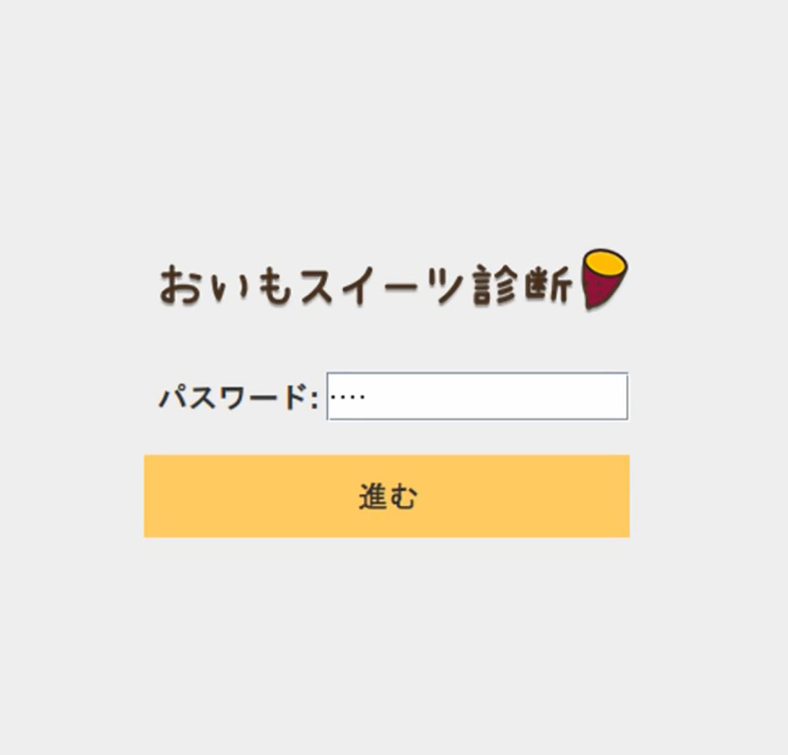
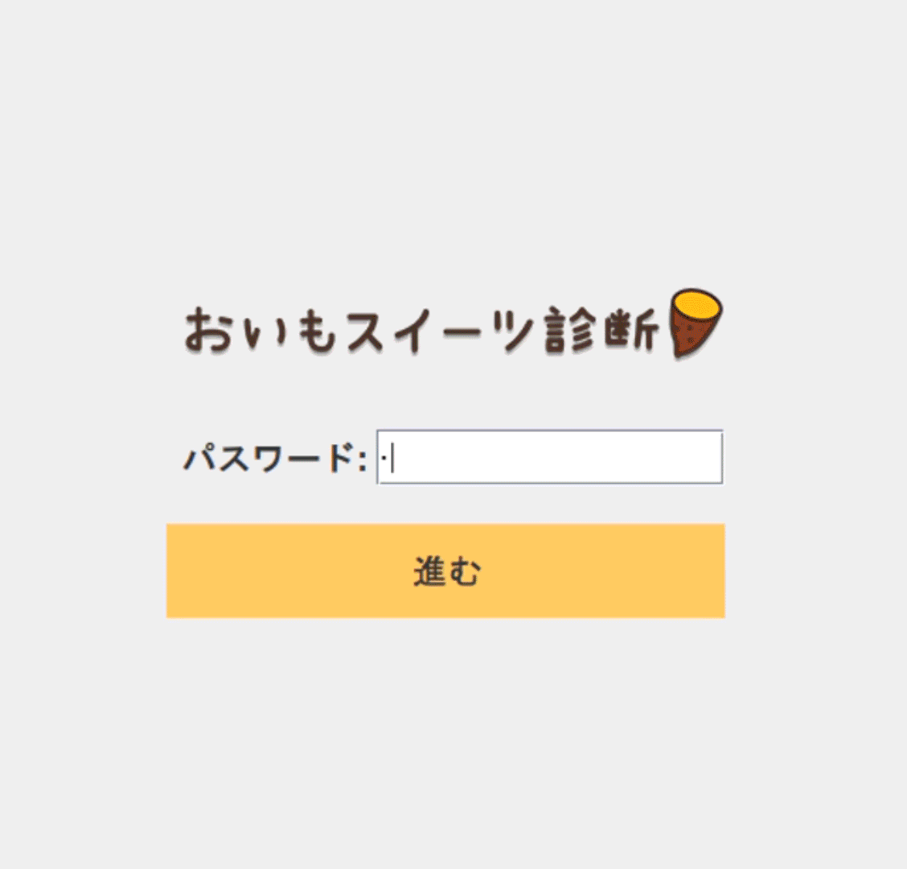

# 🍠 おいもスイーツ診断（Java Swing アプリ）

  
初めてのJava記述練習🌸
Java Swing を使ったかわいい「おいもスイーツ診断」アプリです。  
パスワード認証付きのログイン画面の後に、診断画面が表示されます。
（デモ用の簡易パスワードは「oimo」です。）

 

---

## 🎬 ゲームデモ（GIF）

ゲームのプレイデモです！どんな感じで遊べるか見てください。


---

## 🎮 主な機能

- Java Swing によるGUIアプリケーション
- ログイン認証（パスワード入力）
- 簡単な診断フロー（`Potato.java`で定義）
- デザインは GridBagLayout で細かく調整

---

## 💻 動作環境

- Java 11 以上推奨
- Eclipse（2022年版・2025年版で動作確認済）

---

## 🚀 実行方法

1. **コンパイル**
   ```bash
   javac -d bin -sourcepath src src/oimoselect/*.java
   ```
2. **実行（クラスパスに resources を追加）**
   ```bash
   java -cp "bin:resources" oimoselect.Login 　　# Mac/Linux
   java -cp "bin;resources" oimoselect.Login   　# Windows
   ```
※画像ファイルは resources/images/ に置いてください。
   
---

## 📁 ディレクトリ構成
```plaintext
oimoselect/
├── src/
│   └── oimoselect/
│       ├── Login.java
│       └── Potato.java
├── resources/
│   └── images/
│       └── すべての画像
└── README.md
```
---
## 🥺 ライセンス

このアプリは個人の学習目的で作成されたものであり、**商用利用を禁止**しています。  
その他の利用条件については、[LICENSE](./LICENSE) ファイルをご確認ください。

## 🙌 クレジット

- 当アプリ内で使用している以下の画像は、[PhotoAC](https://www.photo-ac.com/) の素材を使用しています。
- イラスト: eri
- 開発: eri


